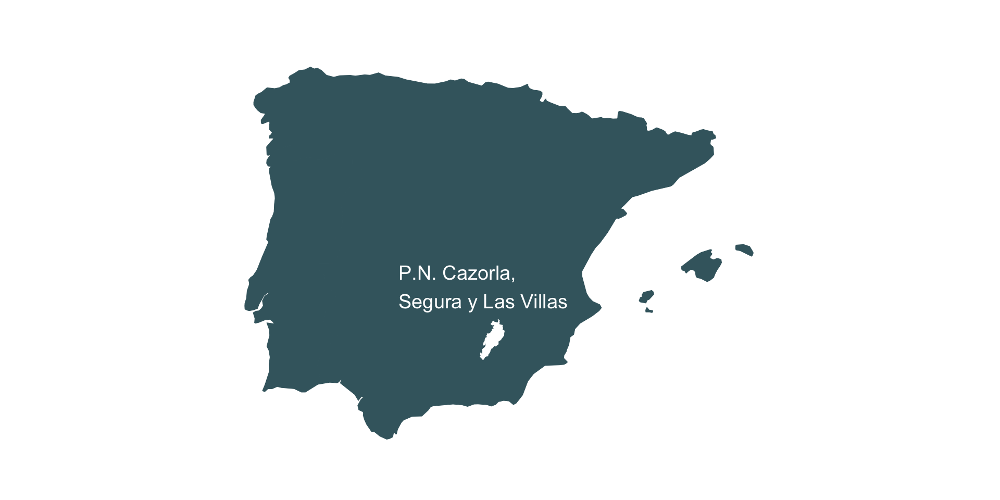
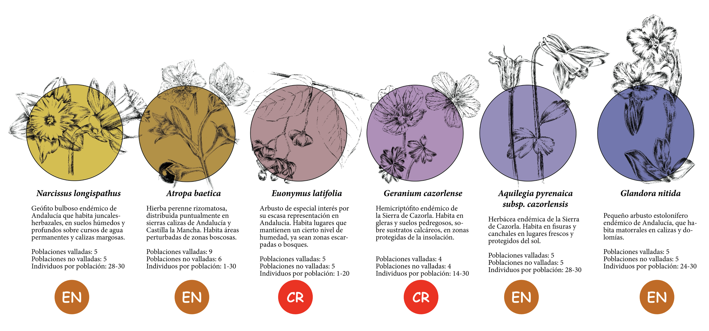
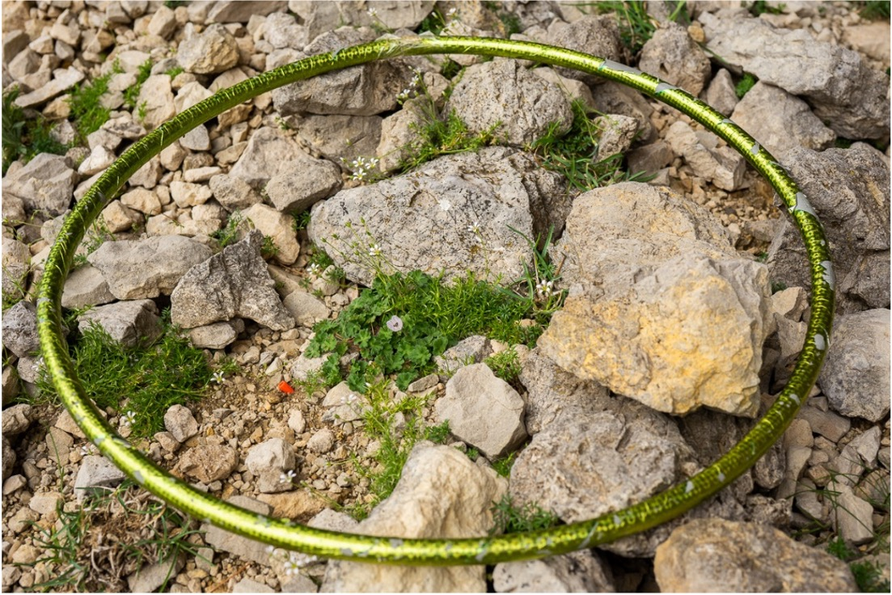
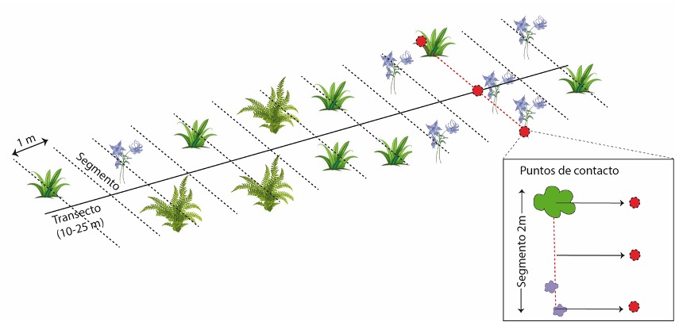
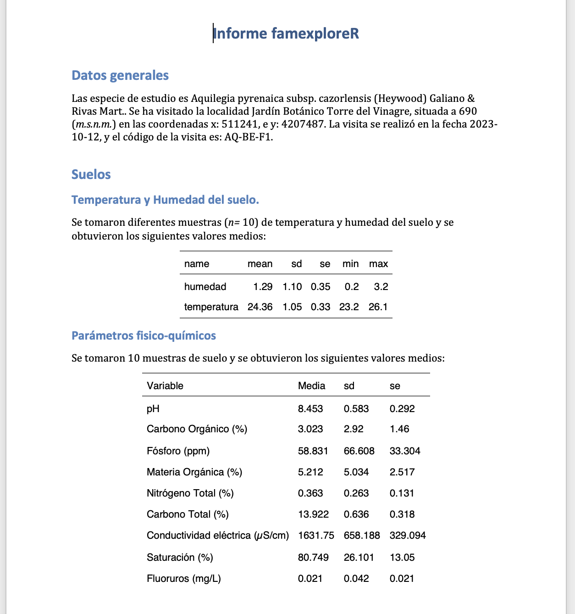

## {.center-h .large-text}

 
¿Cómo podemos ayudar a los  [**técnicos de seguimiento**]{.bg}  
de flora amenazada ([de Andalucía]{.subr})  
a [gestionar]{.bg} sus [datos]{.bg}   de forma ([más]{.subr}) eficiente? 
 
 
# Contexto {background-color="#40666e"}

## 
> ¿Se deben vallar las especies de flora amenazada para protegerlas de los herbívoros?  

![Efectos de los vallados sobre la flora amenazada   [@Lorite2022: Conservación Vegetal]](images/efectos-vallados-rev.png){fig-align="center"}

## 

::: {.cell}

:::

::: {.cell}

:::

:::: {.columns}

::: {.column width="50%"}
- ~ 210000  ha (500-2.107 *msnm*)
- Calizas y calizo-dolomías predominantes 
- Vegetación: Pinares (*Pinus halepensis*, *P. pinaster* y *P. nigra* subsp. *salzmannii*), encinares (*Quercus ilex*) y quejigares (*Q. faginea*)
- Elevada diversidad: 2.200 taxones (360 endemismos bético-rifeños, 35 locales)

:::

::: {.column width="50%"}

::: {.cell layout-align="center"}
::: {.cell-output-display}
{fig-align='center' width=960}
:::
:::

- Gran presión de [herbivoría]{.bg}
  - Efecto importante sobre estructura, composición y regeneración de la vegetación 
  - Principal factor de amenaza para muchas especies en peligro 

:::

::::

## {.center-h}

## [Debilidades]{.bg style="--col: #cd8d61"}
- Deficiente gestión de datos
- Nula estandarización
- Propagación de errores
- Falta de herramientas específicas
- Dificultad para generar informes
- Gran volúmen de datos

[Gestión de datos ineficiente y desactualizada]{.bg style="--col: #cd8d61"}

# Propuesta {background-color="#40666e"}

## 

1. Disminuir complejidad manejo datos
    i) Disminuir manipulación datos 
    ii) Similitud estadillo campo - BBDD
2. Aumentar eficiencia Entrada/Salida Datos
3. Generación Informes de seguimiento de forma sencilla
4. Integración con otras bases de datos
5. Análisis avanzados 
 
## Flujo Trabajo 

1. Introducción datos en hojas de cálculo
    
    i) estandarización nombres archivos

2. Automatizar lectura de datos

3. Generar informes de seguimiento sencillos

# Entrada de datos {background-color="#40666e"}

## {background-image="images/estadillo_original.png" background-size="80%"}

##
### Efecto del vallado sobre Potencial reproductivo, tamaño individual y vecindad
25-30 ind. al azar/población (vallado / no vallado)

- *Potencial reproductivo*: número de flores, frutos y semillas
- *Tamaño individual*: altura, diámetro, biovolumen 
- *Vecindad*: 
    - distancia a individuos más cercanos (*Nearest Neighbour*)
    - densidad por especie
    

{fig-align="center"}

##
### Efecto del vallado sobre la estructura, composición taxonómica y funcional de la comunidad vegetal

- *Composición de la comunidad* (identidad/abundancia relativa): 
    - composición y cobertura (%) dentro/fuera de vallado
    - 3 transectos (10-25m x 2m; 3 ptos.contacto/50 cm)
- *Densidad de la especie focal*
- *Estructura y composición funcional*: 
    - grupos funcionales (herbácea, árbol o arbusto) y clases demográficas (plántula, juvenil y adulto)

{fig-align="center"}

##
### Estimación del daño por herbivoría

Porcentaje de defoliación en escala semicuantitativa (10 individuos por población, 5 hojas por individuo).
{fig-align="center"}

### Densidad ungulados

- Conteo de excrementos: Total excrementos/superficie de 100 m2 en torno a los transecto 

{fig-align="center"}

## Estadillo de campo (digital)

- Simple 
- Fácil manejo
- Similar a estadillo físico 

[Estadillo digital](https://github.com/ajpelu/famexploreR/blob/main/inst/data_ejemplo/ficha_campo.xlsx){.button}

# {background-color="#40666e"}
{fig-align="center"}

## 

-  [shiny]{.bg}-app sencilla para ingesta datos
    - modular 
    - fácil de usar
    - instalable en cualquier sistema operativo
    - servidor / local 

- [paquete R]{.bg}
    - portable 
    - futuras funcionalidades 
    
    
- [Documentación]{.bg}
[https://ajpelu.github.io/famexploreR/](https://ajpelu.github.io/famexploreR/)

- [Live-app*]{.bg}
[http://vlab.iecolab.es/ajpelu/famexploreR/](http://vlab.iecolab.es/ajpelu/famexploreR/)    

- [Repositorio]{.bg}
[https://github.com/ajpelu/famexploreR](https://github.com/ajpelu/famexploreR)
  
## {background-image="images/app_tour.png" background-size="30%"}

## {background-image="images/app_generalv1.png" background-size="80%"}

## [live-app](http://vlab.iecolab.es/ajpelu/famexploreR/)

## Generación Informes 
{fig-align="center"}

# Siguientes (primeros) pasos {background-color="#40666e"}

## 

### Evaluar funcionamiento con técnicos de seguimiento 
- [Tests]{.bg style="--col: #cd8d61"} con más datos reales, más usuarios
- [Feedback]{.bg style="--col: #cd8d61"} para mejorar la interfaz y funcionalidades
 
- Solucionar errores y [bugs]{.bg style="--col: #e64173"}

### Documentación y [mejora]{.bg style="--col: #cd8d61"} del paquete y de la app
 

### [Desarrollo]{.bg style="--col: #cd8d61"} de nuevas funcionalidades
### Implementación de [análisis avanzados]{.bg style="--col: #cd8d61"}
### Integración con otras bases de datos (*e.g.* [GBIF]{.subr})

## Muchas gracias por la atención

-   [\@ajpelu](https://twitter.com/ajpelu)
-   [antonio.perez\@inia.csic.es](mailto:%20antonio.perez@inia.csic.es)

::: small
Ayuda JDC2022-050056-I financiada por MCIN/AEI /10.13039/501100011033 y por la Unión Europea NextGenerationEU/PRTR
:::

{fig-align="center"}

## References

::: {#refs}
:::

